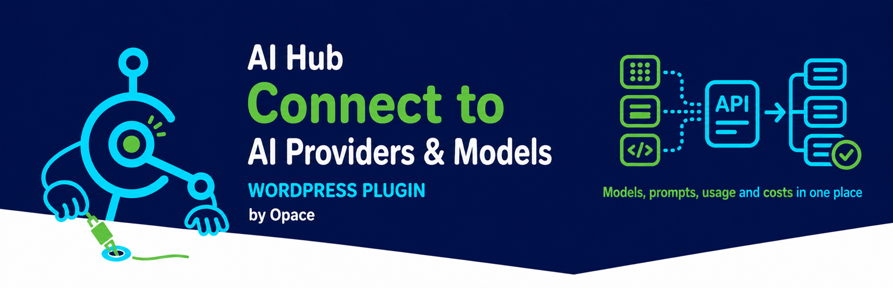

# Opace AI Prompt Library & API Integration Hub for OpenAI, Claude & Gemini (WordPress Plugin)



> [Browse Opace Digital Agency's open-source WordPress plugins, AI agent skills and web platforms](https://github.com/OpaceDigitalAgency/OpaceDigitalAgency)

**Configure AI providers once, then share their models, prompts and usage data across compatible WordPress plugins.**

<p align="center">
  
  
  
  
  
</p>

**[Install AI-Scribe from WordPress.org](https://en-gb.wordpress.org/plugins/ai-scribe-the-chatgpt-powered-seo-content-creation-wizard/)** · **[View AI-Scribe on GitHub](https://github.com/OpaceDigitalAgency/ai-scribe-chat-gpt-content-creator)** · **[View Opace AI Hub on GitHub](https://github.com/OpaceDigitalAgency/opace-ai-prompt-library-api-hub-wordpress-plugin)**

<p align="center">
  <a href="https://github.com/OpaceDigitalAgency/opace-ai-prompt-library-api-hub-wordpress-plugin/releases/latest">Latest release</a>
  · <a href="https://github.com/OpaceDigitalAgency/opace-ai-prompt-library-api-hub-wordpress-plugin/releases/latest">Download ZIP</a>
  · <a href="https://github.com/OpaceDigitalAgency/opace-ai-prompt-library-api-hub-wordpress-plugin/issues">Issues</a>
  · <a href="SECURITY.md">Security</a>
  · <a href="https://github.com/OpaceDigitalAgency/ai-scribe-chat-gpt-content-creator">AI Scribe</a>
  · <a href="https://github.com/OpaceDigitalAgency/OpaceDigitalAgency">More from Opace</a>
</p>

> **Opace AI Hub + [AI Scribe](https://github.com/OpaceDigitalAgency/ai-scribe-chat-gpt-content-creator) are one companion WordPress AI stack, installed as two separate plugins.**
> Opace AI Hub supplies encrypted provider connections, live models, prompts, usage and pricing;
> AI Scribe supplies the guided article, SEO, image, review and publishing workflow. Install Opace AI Hub
> first, then [AI Scribe](https://github.com/OpaceDigitalAgency/ai-scribe-chat-gpt-content-creator).

WordPress.org plugin slug: `opace-ai-prompt-library-api-hub`

Opace AI Hub is an integration hub, not a content generator. It keeps provider credentials in one place,
discovers the models available to your account, normalises provider responses and records usage. A
compatible plugin, such as [AI Scribe](https://github.com/OpaceDigitalAgency/ai-scribe-chat-gpt-content-creator),
uses that shared connection to generate content.

Opace AI Hub is independently developed by Opace Digital Agency and is not affiliated with, endorsed by or sponsored by OpenAI, Anthropic or Google.

## Why Opace AI Hub was built

AI features were becoming harder to maintain as separate WordPress plugins each acquired their own
provider settings, model lists, request formats, prompt storage and cost calculations. That duplicated
security-sensitive code and made provider changes easy to fix in one plugin but miss in another.

Opace AI Hub separates that shared infrastructure from the product workflow. Provider integration can be
maintained and tested once, while each compatible plugin remains focused on its own job. It also gives
site administrators one place to rotate keys, choose models and understand usage.

## How AI Scribe uses Opace AI Hub

**[AI-Scribe on WordPress.org](https://en-gb.wordpress.org/plugins/ai-scribe-the-chatgpt-powered-seo-content-creation-wizard/)** · **[AI-Scribe on GitHub](https://github.com/OpaceDigitalAgency/ai-scribe-chat-gpt-content-creator)** · **[Opace AI Hub on GitHub](https://github.com/OpaceDigitalAgency/opace-ai-prompt-library-api-hub-wordpress-plugin)**

[AI Scribe](https://github.com/OpaceDigitalAgency/ai-scribe-chat-gpt-content-creator) is the first
content workflow built around Opace AI Hub. AI Scribe owns article planning, writing, SEO metadata,
editorial review and WordPress publishing. Opace AI Hub supplies the lower-level services it needs:

- encrypted provider credentials and connection tests
- provider and model selection
- normalised text, image and structured-output requests
- reusable prompts and model capability information
- token, request and estimated-cost records

The split keeps content-generation decisions in AI Scribe and provider plumbing in Opace AI Hub. The two
projects are linked in both directions so users can see which plugin supplies each part of the stack.

## What it provides

- One settings screen for OpenAI, Anthropic Claude and Google Gemini credentials
- Live model discovery based on the models each provider makes available to your account
- Provider-aware request handling for text, images and structured output
- A grouped prompt library with import and export
- Request, token and published-rate cost estimates by provider and model
- A PHP API for WordPress plugins that need the shared configuration
- Encrypted credential storage and an explicit retain-or-remove choice on uninstall

## Supported providers

| Provider | Text | Images | Structured output |
|---|---:|---:|---|
| OpenAI | Yes | Yes | JSON schema through Chat Completions or Responses |
| Anthropic Claude | Yes | No | Forced tool calls |
| Google Gemini | Yes | Yes | Response schemas through the Gemini API |

Provider model lists are discovered at runtime. Opace AI Hub does not promise that a particular model will
be available to every account.

### Current providers and live model catalogue

**Live catalogue snapshot: 23 August 2026 at 13:03 BST (UTC+1).** The Hub refreshed configured provider
accounts at that time and received 132 OpenAI, 10 Anthropic Claude and 50 Google Gemini identifiers.
Provider access varies by account, region and rollout; Settings always uses the current list returned for
your own key. The built-in registry is only a fallback and metadata source when live discovery is unavailable.

#### Multimodal text models selectable in the Hub

These generate text and accept visual input. Image input does not make them dedicated image generators.

- **OpenAI (45):** `gpt-5.6-sol`, `gpt-5.6-terra`, `gpt-5.6-luna`, `gpt-5.5-pro`, `gpt-5.5-pro-2026-04-23`, `gpt-5.5`, `gpt-5.5-2026-04-23`, `gpt-5.4-pro`, `gpt-5.4-pro-2026-03-05`, `gpt-5.4`, `gpt-5.4-2026-03-05`, `gpt-5.4-mini`, `gpt-5.4-mini-2026-03-17`, `gpt-5.4-nano`, `gpt-5.4-nano-2026-03-17`, `gpt-5.2-pro`, `gpt-5.2-pro-2025-12-11`, `gpt-5.2`, `gpt-5.2-2025-12-11`, `gpt-5.1`, `gpt-5.1-2025-11-13`, `gpt-5-pro`, `gpt-5-pro-2025-10-06`, `gpt-5`, `gpt-5-2025-08-07`, `gpt-5-mini-2025-08-07`, `gpt-5-mini`, `gpt-5-nano-2025-08-07`, `gpt-4.1-2025-04-14`, `gpt-4.1`, `gpt-4.1-mini-2025-04-14`, `gpt-4.1-mini`, `gpt-4.1-nano`, `gpt-4.1-nano-2025-04-14`, `gpt-4o-2024-05-13`, `gpt-4o-2024-08-06`, `gpt-4o-2024-11-20`, `gpt-4-0613`, `gpt-4o`, `gpt-4-turbo`, `gpt-4-turbo-2024-04-09`, `gpt-4o-mini-2024-07-18`, `gpt-4o-mini`, `o3`, `o3-mini`
- **Anthropic Claude (7):** `claude-opus-5`, `claude-opus-4-8`, `claude-opus-4-7`, `claude-opus-4-6`, `claude-sonnet-4-6`, `claude-opus-4-5-20251101`, `claude-sonnet-4-5-20250929`
- **Google Gemini (6):** `gemini-3.6-flash`, `gemini-3.1-pro-preview`, `gemini-3.1-pro-preview-customtools`, `gemini-2.5-pro`, `gemini-2.5-flash`, `gemini-pro-latest`

#### Text and reasoning models selectable in the Hub

- **OpenAI (17):** `gpt-5-nano`, `gpt-4`, `gpt-3.5-turbo-0125`, `gpt-3.5-turbo-1106`, `gpt-3.5-turbo-16k`, `gpt-3.5-turbo`, `o4-mini-2025-04-16`, `o4-mini`, `o3-pro`, `o3-pro-2025-06-10`, `o3-2025-04-16`, `o3-mini-2025-01-31`, `o1-pro`, `o1-pro-2025-03-19`, `o1`, `o1-2024-12-17`, `chat-latest`
- **Anthropic Claude (3):** `claude-sonnet-5`, `claude-fable-5`, `claude-haiku-4-5-20251001`
- **Google Gemini (11):** `gemini-3.7-flash`, `gemini-3.5-flash`, `gemini-3.5-flash-lite`, `gemini-3.1-flash-lite-preview`, `gemini-3.1-flash-lite`, `gemini-3-flash-preview`, `gemini-2.5-flash-lite`, `gemini-flash-latest`, `gemini-flash-lite-latest`, `gemma-4-26b-a4b-it`, `gemma-4-31b-it`

#### Image-generation models selectable in the Hub

- **OpenAI (6):** `gpt-image-2`, `gpt-image-2-2026-04-21`, `gpt-image-1.5`, `gpt-image-1`, `gpt-image-1-mini`, `chatgpt-image-latest`
- **Google Gemini (7):** `gemini-3.1-flash-image`, `gemini-3.1-flash-image-preview`, `gemini-3.1-flash-lite-image`, `gemini-3-pro-image`, `gemini-3-pro-image-preview`, `gemini-2.5-flash-image`, `nano-banana-pro-preview`
- **Anthropic Claude:** no image-generation models were returned.

#### Live specialist models catalogued, not currently invoked

The Hub retains these live identifiers for capability-aware add-ons, but its present public helpers only
execute text, structured-output and image requests. Listing a specialist model here does not claim a
working Hub request path for that category.

- **OpenAI audio, speech and realtime (31):** `gpt-4o-transcribe`, `gpt-4o-transcribe-diarize`, `gpt-4o-mini-transcribe`, `gpt-4o-mini-transcribe-2025-03-20`, `gpt-4o-mini-transcribe-2025-12-15`, `gpt-4o-mini-tts`, `gpt-4o-mini-tts-2025-03-20`, `gpt-4o-mini-tts-2025-12-15`, `gpt-realtime-2.1`, `gpt-realtime-2.1-mini`, `gpt-realtime-2`, `gpt-audio-1.5`, `gpt-realtime-1.5`, `gpt-transcribe`, `gpt-audio`, `gpt-audio-2025-08-28`, `gpt-audio-mini`, `gpt-audio-mini-2025-10-06`, `gpt-audio-mini-2025-12-15`, `gpt-live-transcribe`, `gpt-realtime`, `gpt-realtime-2025-08-28`, `gpt-realtime-mini`, `gpt-realtime-mini-2025-12-15`, `gpt-realtime-translate`, `gpt-realtime-whisper`, `whisper-1`, `tts-1`, `tts-1-1106`, `tts-1-hd`, `tts-1-hd-1106`
- **Gemini audio, music and live (10):** `gemini-3.5-live-translate-preview`, `gemini-3.1-flash-live-preview`, `gemini-3.1-flash-tts-preview`, `gemini-2.5-pro-preview-tts`, `gemini-2.5-flash-native-audio-latest`, `gemini-2.5-flash-native-audio-preview-09-2025`, `gemini-2.5-flash-native-audio-preview-12-2025`, `gemini-2.5-flash-preview-tts`, `lyria-3-pro-preview`, `lyria-3-clip-preview`
- **Embeddings (6):** OpenAI `text-embedding-3-small`, `text-embedding-3-large`, `text-embedding-ada-002`; Gemini `gemini-embedding-2-preview`, `gemini-embedding-2`, `gemini-embedding-001`
- **Video (5):** OpenAI `sora-2-pro`, `sora-2`; Gemini `veo-3.1-fast-generate-preview`, `veo-3.1-generate-preview`, `veo-3.1-lite-generate-preview`
- **OpenAI code (6):** `gpt-5.3-codex`, `gpt-5.2-codex`, `gpt-5.1-codex-max`, `gpt-5.1-codex`, `gpt-5.1-codex-mini`, `gpt-5-codex`
- **OpenAI research and search (10):** `o4-mini-deep-research`, `o4-mini-deep-research-2025-06-26`, `o3-deep-research`, `o3-deep-research-2025-06-26`, `gpt-5-search-api`, `gpt-5-search-api-2025-10-14`, `gpt-4o-search-preview`, `gpt-4o-search-preview-2025-03-11`, `gpt-4o-mini-search-preview`, `gpt-4o-mini-search-preview-2025-03-11`
- **Gemini research (3):** `deep-research-max-preview-04-2026`, `deep-research-preview-04-2026`, `deep-research-pro-preview-12-2025`
- **Computer-use and agent models (4):** OpenAI `computer-use-preview`, `computer-use-preview-2025-03-11`; Gemini `gemini-2.5-computer-use-preview-10-2025`, `antigravity-preview-05-2026`
- **Gemini robotics and question answering (4):** `gemini-robotics-er-2-preview`, `gemini-robotics-er-2-streaming-preview`, `gemini-robotics-er-1.6-preview`, `aqa`
- **OpenAI moderation (2):** `omni-moderation-2024-09-26`, `omni-moderation-latest`
- **Legacy or provider-specific text IDs excluded from the prose picker (9):** OpenAI `gpt-5.3-chat-latest`, `gpt-5.2-chat-latest`, `gpt-5.1-chat-latest`, `gpt-5-chat-latest`, `gpt-3.5-turbo-instruct`, `gpt-3.5-turbo-instruct-0914`, `babbage-002`, `davinci-002`; Gemini `gemini-omni-flash-preview`

### Dynamic defaults

A valid saved choice is always preserved. If a choice is missing or retired, Opace AI Hub ranks the
configured account's live list inside the intended family rather than falling back to an unrelated
old model:

| Provider | Writing default | Image default |
|---|---|---|
| OpenAI | newest mainstream Terra model, medium reasoning; current registry fallback `gpt-5.6-terra` | newest GPT Image model; current fallback `gpt-image-2` |
| Anthropic | newest Claude Opus model, medium effort; current fallback `claude-opus-5` | none |
| Gemini | newest non-Lite Gemini Flash model, medium thinking; current stable fallback `gemini-3.6-flash` | newest Gemini Flash Image / Nano Banana model; current fallback `gemini-3.1-flash-image` (Nano Banana 2) |

Live discovery takes precedence over those maintained fallback identifiers. A later model in the
same preferred family can therefore become the default without a plugin update, while an explicit
valid choice made by an administrator is never silently replaced.

## How it fits together

```text
AI Scribe       another compatible plugin       your plugin
    \                    |                           /
     \                   |                          /
      +---------------- Opace AI Hub -------------------+
      | credentials · models · prompts · usage     |
      +---------+-------------+-------------+-------+
                |             |             |
             OpenAI       Anthropic       Gemini
```

## Installation

1. [Download the latest release ZIP](https://github.com/OpaceDigitalAgency/opace-ai-prompt-library-api-hub-wordpress-plugin/releases/latest), or build it from this repository.
2. In WordPress, open **Plugins → Add New Plugin → Upload Plugin**.
3. Upload the ZIP and activate **Opace AI Hub**.
4. Open **Opace AI Hub → Settings** and enter a key for at least one provider.
5. Test the key, select a default provider and save.
6. Install [AI Scribe](https://github.com/OpaceDigitalAgency/ai-scribe-chat-gpt-content-creator), following its current repository instructions, to add the guided content, SEO and publishing workflow.

Plugins that depend on Opace AI Hub can then use the saved configuration.

## PHP API

Use the public `ai_core()` helper from server-side WordPress code:

```php
if ( ! function_exists( 'ai_core' ) ) {
    return;
}

$provider = 'openai';
$model    = ai_core()->get_default_model_for_provider( $provider );

if ( ! $model ) {
    return;
}

$response = ai_core()->send_text_request(
    $model,
    array(
        array(
            'role'    => 'user',
            'content' => 'Write a concise headline about tea.',
        ),
    ),
    ai_core()->get_provider_options( $provider, $model ),
    array( 'tool' => 'my-plugin' )
);

if ( is_wp_error( $response ) ) {
    $message = $response->get_error_message();
} else {
    $text = AICore\AICore::extractContent( $response );
}
```

The helper also exposes configured providers, live models, image generation and usage statistics.
Treat provider credentials as secrets and never expose them in HTML, JavaScript, logs or public API
responses.

## Security and privacy

- Provider keys are encrypted at rest with AES-256-CBC, a random initialisation vector per value and
  a key derived from the site's WordPress salts.
- Encryption fails closed: if Opace AI Hub cannot encrypt a key, it does not save the key as plain text.
- Rotating the salts in `wp-config.php` makes existing encrypted keys unreadable. Re-enter them after
  a salt rotation.
- Opace AI Hub does not include analytics or user tracking.
- Generation data goes only to the provider selected for that request. Pricing lookups send only a
  provider name and model identifier to the public LiteLLM catalogue.

See [SECURITY.md](SECURITY.md) for private vulnerability reporting.

## External services

Opace AI Hub connects only when an administrator configures a provider or a compatible plugin requests a
generation. It may connect to:

- [OpenAI](https://openai.com/) for OpenAI model discovery and generation
- [Anthropic](https://www.anthropic.com/) for Claude model discovery and generation
- [Google Gemini](https://ai.google.dev/) for Gemini model discovery and generation
- [LiteLLM's public model catalogue](https://github.com/BerriAI/litellm) for published model-pricing data

The WordPress.org `readme.txt` in this repository states what each service receives and links to its
terms and privacy information.

## Data removal

Opace AI Hub keeps its data by default because other plugins may rely on it. To remove all Opace AI Hub-owned
credentials, settings, prompt tables, statistics and caches, turn off **Persist Settings on
Uninstall** before deleting the plugin. Opace AI Hub does not delete another plugin's data.

## Related projects and roadmap

- [AI Scribe](https://github.com/OpaceDigitalAgency/ai-scribe-chat-gpt-content-creator) — guided AI
  content and SEO workflow; the first plugin to use Opace AI Hub's shared infrastructure
- **AI-Imagen** — a planned image-generation workflow intended to use Opace AI Hub; it is not included in
  this release and has no announced release date
- [Opace Agent Skills](https://github.com/OpaceDigitalAgency/skills) — reusable skills for AI coding
  agents

Future compatible plugins can use the same public PHP API. Roadmap names describe direction, not a
promise of availability.

## WordPress AI Client integration

On WordPress 7.0 or newer, version 1.0.11 shares credentials at runtime with registered WordPress AI
providers. Connector, environment-variable and constant credentials take precedence and are never
copied into Hub storage. An encrypted Hub key can also authenticate the matching core provider for
external plugins in the same request. This requires the corresponding official OpenAI, Anthropic or
Google AI provider plugin; WordPress core supplies the client and Connector UI, not provider implementations.

## Video walkthrough

[](https://www.youtube.com/watch?v=nn3tV6UqJT4)

[Watch Opace AI Hub on YouTube](https://www.youtube.com/watch?v=nn3tV6UqJT4) — provider setup, live model discovery, the Prompt Library, usage statistics and companion-plugin integration.

## Screenshots

| Provider settings | Dashboard |
|---|---|
| [](.wordpress-org/screenshot-1.png) | [](.wordpress-org/screenshot-2.png) |
| **Prompt Library** | **Statistics** |
| [](.wordpress-org/screenshot-3.png) | [](.wordpress-org/screenshot-4.png) |
| **Compatible add-ons** | |
| [](.wordpress-org/screenshot-5.png) | |

## Release history

Version 1.0.14 documents the paired AI-Scribe 3.2.36 compatibility boundary and makes release ZIPs reproducible. Version 1.0.13 separates consented AI-Scribe installation from the administrator's explicit activation action while keeping both steps in the same Add-ons card. Version 1.0.12 adds a consent-led, state-aware WordPress.org installer for AI-Scribe and corrects action-icon alignment across Hub screens. Version 1.0.11 adds two-way runtime credential and model integration with the WordPress 7.0 AI Client and Connectors APIs without duplicating stored keys, and makes the complete reachable admin interface translation-ready. Version 1.0.10 documents the complete timestamped live inventory and distinguishes selectable generation models from catalogued specialist models. Version 1.0.9 makes the WordPress.org links clickable. Version 1.0.8 is the WordPress.org approval release, keeps `Tested up to` in the supported listing readme rather than the main PHP header, and adds a Plugins-page review link. Version 1.0.7 uses the complete approved installed-plugin branding, a white WordPress sidebar symbol, a tidy notice layout, an explicit provider non-affiliation statement and documented Plugin Check exceptions for the Hub's intended provider-integration role. Version 1.0.6 adds the approved installed-plugin branding and small icon variants. Version 1.0.5
classifies the complete provider catalogue while keeping non-prose products out of
text-model selectors. Version 1.0.4 retries
transient provider connection failures once. Version 1.0.3 synchronises every
runtime version marker and makes the build reject future mismatches.
Version 1.0.2 restores the Prompt Library assets after the public menu rename. Version 1.0.1
addressed the WordPress.org review feedback and updated the public identity to Opace AI Hub. Both
were tested with WordPress 7.1. See [CHANGELOG.md](CHANGELOG.md) for the full release history.

## Build a WordPress.org-ready ZIP

```bash
bin/build-zip.sh
```

The build script checks that the plugin header, `AI_CORE_VERSION` and the WordPress.org stable tag
match. It creates `dist/opace-ai-prompt-library-api-hub-1.0.14.zip`, makes the installed directory
slug `opace-ai-prompt-library-api-hub`, and excludes development files and unshipped add-ons.

## Licence

Opace AI Hub is licensed under [GPL-2.0-or-later](https://www.gnu.org/licenses/old-licenses/gpl-2.0.html).

## Opace services

Opace AI Hub is maintained by [Opace Digital Agency](https://opace.agency/), a Birmingham digital agency:

- [Web design and development](https://opace.agency/services/web-design/)
- [WordPress development](https://opace.agency/services/web-design/wordpress-development/)
- [AI SEO services](https://opace.agency/services/ai-seo/)

For GitHub repository metadata, the recommended sidebar website is the
[Opace web design service](https://opace.agency/services/web-design/).
